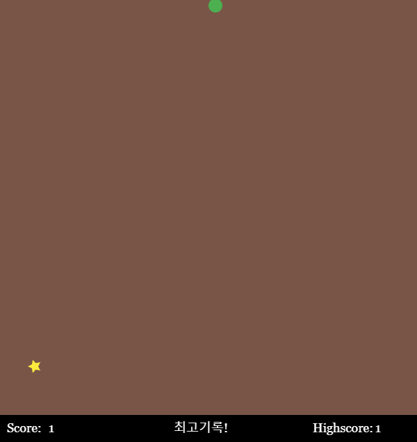

# Snake Game 팀프로젝트
## 소스코드
``` java script
var s;
var scl = 20;
var food;
playfield = 600;

function setup() {
  createCanvas(playfield, 640);
  background(51);
  s = new Snake();
  frameRate (15);
  pickLocation();
  noStroke();
}

function draw() {
  background('#795548');
  scoreboard();
  if (s.eat(food)) {
    pickLocation();
  }
  s.death();
  s.update();
  s.show();

  fill ('#FFEB3B');
  star(food.x+10,food.y+10, 10, 5,5);
    
}

// 별 모양 추가

function star(x, y, radius1, radius2, npoints) {
  let angle = TWO_PI / npoints;
  let halfAngle = angle / 2.0;
  beginShape();
  for (let a = 0; a < TWO_PI; a += angle) {
    let sx = x + cos(a) * radius2;
    let sy = y + sin(a) * radius2;
    vertex(sx, sy);
    sx = x + cos(a + halfAngle) * radius1;
    sy = y + sin(a + halfAngle) * radius1;
    vertex(sx, sy);
  }
  endShape(CLOSE);
}
// 음식이 나타날 위치

function pickLocation() {
  var cols = floor(playfield/scl); // floor(n) : n값보다 작거나 같은 수들 중에서 가장 가까운 정수 값을 저장
  var rows = floor(playfield/scl); 
  food = createVector(floor(random(cols)), floor(random(rows)));
  food.mult(scl); // food에 있는 x와 y좌표에 scl만큼 곱해주는 함수

  // 음식이 꼬리와 겹쳐서 생성되는지 확인

  for (var i = 0; i < s.tail.length; i++) {
    var pos = s.tail[i];
    var d = dist(food.x, food.y, pos.x, pos.y); // dist함수는 (a,b,c,d) ab의 좌표와 cd의 좌표사이의 거리를 구함
    if (d < 1) {
      pickLocation();
    }
  }
}

// 점수판

function scoreboard() {
  fill(0);
  rect(0, 600, 600, 40);
  fill(255);
  textFont("Georgia");
  textSize(18);
  text("Score: ", 10, 625);
  text("Highscore: ", 450, 625);
  text(s.score, 70, 625);
  text(s.highscore, 540, 625);
   if(s.score >= s.highscore)
    text("최고기록!", 250,625);
}

// 방향키를 이용한 컨트롤 기능

function keyPressed() {
  if (keyCode === UP_ARROW){
      s.dir(0, -1);
  }else if (keyCode === DOWN_ARROW) {
      s.dir(0, 1);
  }else if (keyCode === RIGHT_ARROW) {
      s.dir (1, 0);
  }else if (keyCode === LEFT_ARROW) {
      s.dir (-1, 0);
  }
}

// 뱀 만들기
// 뱀의 시작 부분
function Snake() {
  this.x =0;
  this.y =0;
  this.xspeed = 1;
  this.yspeed = 0;
  this.total = 0;
  this.tail = [];
  this.score = 1;
  this.highscore = 1;

// 이동, 이동방향

  this.dir = function(x,y) {
    this.xspeed = x;
    this.yspeed = y;
  }

// 음식을 먹으면 점수가 오르고 꼬리가 1개 더 생김

  this.eat = function(pos) {
    var d = dist(this.x, this.y, pos.x, pos.y);
    if (d < 1) {
      this.total++;
      this.score++;
      text(this.score, 70, 625);
      if (this.score > this.highscore) {
        this.highscore = this.score;
      }
      text(this.highscore, 540, 625);
      return true;
    } else {
      return false;
    }
  }

// 머리가 꼬리에 닿을 때 사망하고 현재 점수가 0이 됨

  this.death = function() {
    for (var i = 0; i < this.tail.length; i++) {
      var pos = this.tail[i];
      var d = dist(this.x, this.y, pos.x, pos.y);
      if (d < 1) {
        this.total = 0;
        this.score = 0;
        this.tail = [];
      }
    }
  }

// 꼬리와 위치 업데이트

  this.update = function(){
    if (this.total === this.tail.length) {
      for (var i = 0; i < this.tail.length-1; i++) {
        this.tail[i] = this.tail[i+1];
    }

    }
    this.tail[this.total-1] = createVector(this.x, this.y);

// 좌표를 반복해서 this.xspeed(0 아니면 1)*scl만큼 이동시켜서 자연스럽게 이동하게 하기
    this.x = this.x + this.xspeed*scl;
    this.y = this.y + this.yspeed*scl;

// 뱀 머리의 x와 y좌표를 0부터 playfield-scl으로 제한
    this.x = constrain(this.x, 0, playfield-scl); // constrain(n,a,b)함수  n을 a와 b사이의 값으로 제한함
    this.y = constrain(this.y, 0, playfield-scl);


  }
  
// 머리와 꼬리를 화면에 보여줌

  this.show = function(){
    fill('#4CAF50');
 // 꼬리부분 
    for (var i = 0; i < this.tail.length; i++) {
        ellipse(this.tail[i].x+10, this.tail[i].y+10, scl, scl);
    }
    
// 머리부분
    ellipse(this.x+10, this.y+10, scl, scl);
  }
}
```

## 실행결과


## 변형 내용
* 프레임레이트를 약간 올려서 이동속도를 조금 올려봤습니다.
* 먹이의 모양을 원이 아닌 별 모양으로 바꿔봤습니다.
* 뱀의 모양을 사각형이 아닌 원으로 바꿔봤습니다.
* 배경과 뱀의 색깔을 바꿔봤습니다.
* 스코어 보드에서 최고기록을 달성했을 때 문구가 출력되게 했습니다.

## 소감
* 추승범
> 게임을 전부 직접 만들지는 않았지만 하나를 추가하거나 변형 시켰을 때 바로 게임에 반영되어서 바뀌는 점이 너무 재미있었습니다. 처음 보는 함수도 이렇게 공부하니까 더 알기 쉽고 기억에 오랫동안 남을 것 같습니다. 팀원 분들의 빛나는 아이디어로 수월하게 팀프로젝트를 마쳤습니다. 이번 팀프로젝트를 경험으로 삼아서 혼자서 작은 게임을 만들 수 있을 정도로 열심히 공부하겠습니다. 감사합니다.


* 김석환
> 이번 프로젝트를 진행하면서 전보다는 코드를 이해하는 데 있어 확실히 빨라졌다는걸 느꼈습니다. 3차원 지형과제에서 실패한 별모양 코드도 한번더 복습하는 계기가 되었고, 게임을 만들기는 처음인데 간단하긴 했지만 게임을 좋아함에 있어서 자바스크립트에 흥미를 더욱 붙있 수 있는 계기가 되었던 것 같습니다.

